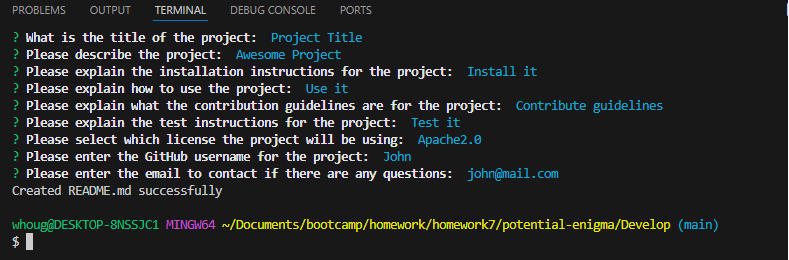
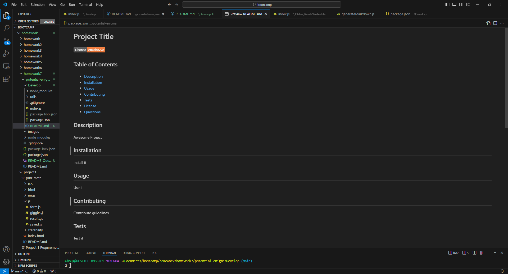

# Professional README Generator 

## Description
The application can generated a professional README.md file once the user has filled out all the required information.

## Links
GitHub Link: https://github.com/whougie/readme-generator.git

## Usage
Filling out the questions

Example of generated README.md

